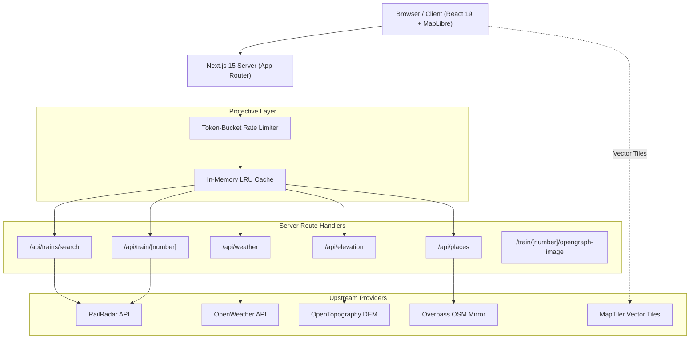

# 🚂 RailGaadi (रेलगाड़ी)

> **A calm, map-first live Indian train tracker turning real-time running status into an immersive journey experience.**

[](https://nextjs.org/)
[](https://react.dev/)
[](https://www.typescriptlang.org/)
[](https://tailwindcss.com/)
[](https://maplibre.org/)
[](LICENSE)

---

## 🌟 Overview

Most train tracking applications in India feel noisy, cluttered, and anxiety-inducing. **RailGaadi** takes inspiration from calm flight trackers, delivering a map-centric journey companion that pairs precise real-time running data with aesthetic visual design.

From the iconic **Indian Railways yellow station plaques** to **smooth train marker animations**, **elevation profiles across mountain ghats**, and **corridor landmark discoveries**, RailGaadi elevates train tracking into a delightful travel story.

Built at *Build & Beyond* (ISTE KJSCE) by **Yash Shah**.

---

## ✨ Features

### 1. 📍 Live Train Tracking
- **Instant Search**: Debounced (250ms) search combobox querying 10,000+ Indian Railways trains by number or name.
- **Iconic Station Plaque**: Faithfully recreates Indian Railways platform signage (rich yellow `#F59E0B`, bilingual Hindi/English typography, terminal indicator chevrons).
- **Live Running Status**: Delay indicators (On Time / Delayed), distance covered and remaining, completed progress rail, and ETA to upcoming stops.
- **Smart Polling**: 30-second background auto-refresh with manual sync trigger and stale-while-revalidate caching.
- **"My Station" Deep Linking**: Set your arrival station to activate a dedicated live countdown banner and shareable links (`/train/12951?stn=BRC`).

### 2. 🗺️ Immersive Journey Map
- **Full-Screen Interactive Vector Map**: Powered by MapLibre GL with dark, high-contrast cartography.
- **Track Progression Geometry**: Route sliced dynamically using Turf.js into **solid blue completed track** and **muted dashed upcoming track**.
- **Smooth Marker Tweening**: 1.5-second `requestAnimationFrame` easing tween between discrete GPS pings with automatic heading calculation to orient the train icon along track curves.
- **Interactive Controls**: Follow-train camera lock, zoom/pitch controls, and station popovers with scheduled vs actual timings.
- **Adaptive Layout**: Desktop side-by-side split screen + mobile touch-draggable bottom sheet.

### 3. 📊 Companion & Journey Analytics
- **Live Delay Curve**: Interactive Recharts visualization plotting minutes delay against journey distance (km), highlighting delay accumulation and recovery sections.
- **Topographical Elevation Profile**: Sampled along route coordinates via OpenTopography Global DEM (SRTM), highlighting route summits (Western Ghats, Vindhya/Malwa Plateau) with train position indicator.
- **Weather Trio**: Real-time temperature, sky condition, and rain alerts for **Source Station**, **On-Board (Current Location)**, and **Destination Station** via OpenWeather API.

### 4. 🧭 Corridor Discoveries & Social Sharing
- **Corridor Exploration**: Discovers scenic landmarks along the railway corridor using OpenStreetMap Overpass API (major rivers, bridges, tunnels, mountain passes, monuments, and towns) with live `km ahead` countdowns.
- **Dynamic OpenGraph Social Previews**: Server-side generated `1200x630` social cards (`next/og`) rendering custom train placards for WhatsApp, Twitter, and iMessage previews.
- **Native Web Share**: Share journey state with one click via Web Share API or clipboard copy fallback.

### 5. 🛡️ Production Hardening
- **Token-Bucket Rate Limiting**: Per-IP in-memory rate limiter with standard HTTP `429 Too Many Requests` and `Retry-After` headers.
- **LRU Cache Service**: In-memory LRU cache with configurable TTLs to protect upstream APIs.
- **Strict Security Headers & CSP**: Content Security Policy whitelisting only trusted map and data domains, anti-clickjacking (`X-Frame-Options: DENY`), and anti-MIME sniffing.
- **Automated Smoke Test Suite**: 28 automated integration tests validating all endpoints, headers, and rate limits (`npm run test:smoke`).

---

## 🏗️ Architecture



---

## 💻 Tech Stack

| Layer | Technology |
|---|---|
| **Framework** | Next.js 15.3 (App Router), React 19 |
| **Language** | TypeScript (Strict Mode) |
| **Styling** | Tailwind CSS v4, Vanilla CSS tokens |
| **Map Engine** | MapLibre GL 5.3, Turf.js (Spatial analysis) |
| **Charts** | Recharts 3.0 |
| **Icons & Animation** | Lucide React, Framer Motion |
| **State Management** | Zustand 5.0, TanStack Query |
| **Validation** | Zod 3.24 |
| **Data Providers** | RailRadar, OpenWeather, OpenTopography, Overpass OSM |

---

## 🚀 Getting Started

### Prerequisites
- Node.js 18.18+ or Node.js 20+
- npm, pnpm, or yarn

### 1. Clone the Repository
```bash
git clone https://github.com/Yashshah4536/Railgaadi.git
cd RailGaadi
```

### 2. Install Dependencies
```bash
npm install
```

### 3. Configure Environment Variables
Copy `.env.example` to `.env.local`:
```bash
cp .env.example .env.local
```

Fill in your API credentials:
```env
# MapTiler (Client-side vector map tiles)
NEXT_PUBLIC_MAPTILER_KEY=your_maptiler_key

# RailRadar (Live train tracking & schedules)
RAILRADAR_API_KEY=your_railradar_key

# OpenWeather (Journey companion weather)
OPENWEATHER_API_KEY=your_openweather_key

# OpenTopography (Route elevation profile)
OPENTOPOGRAPHY_API_KEY=your_opentopography_key
```

### 4. Run Development Server
```bash
npm run dev
```

Open [http://localhost:3000](http://localhost:3000) in your browser.

---

## 🧪 Testing & Verification

RailGaadi includes an automated smoke test suite verifying all 9 endpoints, security headers, rate limiting, and cache behavior:

```bash
# Type check TypeScript codebase
npm run type-check

# Run automated smoke test suite (with dev server running)
npm run test:smoke

# Build for production
npm run build
```

---

## 📁 Project Structure

```
RailGaadi/
├── app/
│   ├── api/                   # Server-side proxy handlers (RailRadar, Weather, Elevation, Places)
│   ├── train/[number]/        # Dynamic train tracking route & OpenGraph image generator
│   ├── globals.css            # Tailwind v4 import & design system tokens
│   ├── layout.tsx             # Root layout with Google Fonts
│   └── page.tsx               # Landing page with hero search and recent trains
├── components/
│   ├── journey/               # Journey components (StationPlaque, DelayChart, ElevationChart, WeatherTrio, etc.)
│   ├── map/                   # MapLibre GL integration, marker animations, controls
│   ├── search/                # Combobox search, recent & favorite trains
│   └── ui/                    # Reusable UI primitives & responsive BottomSheet
├── fixtures/                  # Real API response samples for provider type derivation
├── lib/
│   ├── analytics.ts           # Privacy-respecting client telemetry
│   ├── env.ts                 # Zod environment variable schema
│   ├── ratelimit.ts           # In-memory Token-Bucket rate limiter
│   ├── geo/                   # Turf.js route slicing and marker interpolation
│   └── providers/             # Adapters for RailRadar, OpenWeather, OpenTopography, Overpass
├── services/                  # LRU caching service
├── types/                     # Shared TypeScript models and interfaces
└── scripts/                   # Automated smoke testing scripts
```

---

## 📄 License

This project is licensed under the MIT License — see the [LICENSE](LICENSE) file for details.

Built with ❤️ for Indian Railways travelers.
